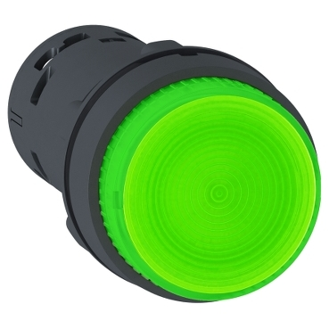

# Dianthus

*In the world of GUI, less mouse pointers, more fat fingers buttons.* 

A button box to interface with web-based GUI, when you want to just push on buttons to do repetitive tasks. This replaces the need for the small buttons of a keyboard, or *worse*, a MOUSE.

* Hardware Supported: This box is based on the XB7 industrial button from Schneider electrics. And a promicro development board.
* Hardware Availability: 

## Installation guide

## Fabrication guide

All related documents can be found on the `livrables` folder (Procurement list, PCB production file, STL, ...)

### PCB Fabrication

### Schneider customisation button

### 3D printing files

The source files can be found on [Onshape project](https://cad.onshape.com/documents/cb52971ac28a8f36a2bdde5f/w/7d97d8c1100cd4f538ea172c/e/2ed6b61c8d6aeb3da16c9e53).
